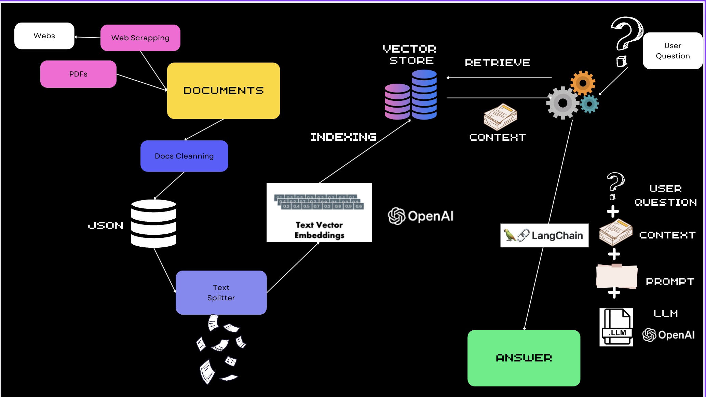

# Burgos Data Hacking

## Description

This project delivers a solution for the Datathon organized in Burgos by the Google Developer Group. The challenge was to extract valuable information from any public data source and process it to understand the current status of one or several observatory objectives.



## Data Sources

Data can be sourced from various public platforms such as press releases, official state bulletins, ministries, Castilla y León regional government, county council, city hall, INE (National Institute of Statistics), CEOE (Spanish Confederation of Employers' Organizations), unions, Social Security, etc.

## Workflow

The project is divided into two main parts:

1. **Text Acquisition**: This involves gathering and processing the data. The code uses web scraping techniques to create several JSONL files with the information obtained from sources. Sources are configured in the file config.yaml

2. **Data Processing**: This part of the project creates a Retrieval Augmented Generation (RAG) using the Langchain library, and offer a conversation chat with using Python Streamlit

## Setup and Execution

To set up and run the project, follow the steps below:

1. Install the project dependencies using Poetry:

```
poetry install
```

2. Run the text extractor script:

```
poetry run python burgosdatahacking/text_extractor.py
```

3. Start the Streamlit application, be sure that you have your OPEN-AI key in the constants.py

```
poetry run streamlit run burgosdatahacking/conversation_ai.py
```

Please ensure you have the necessary permissions to access and scrape data from the chosen sources.
